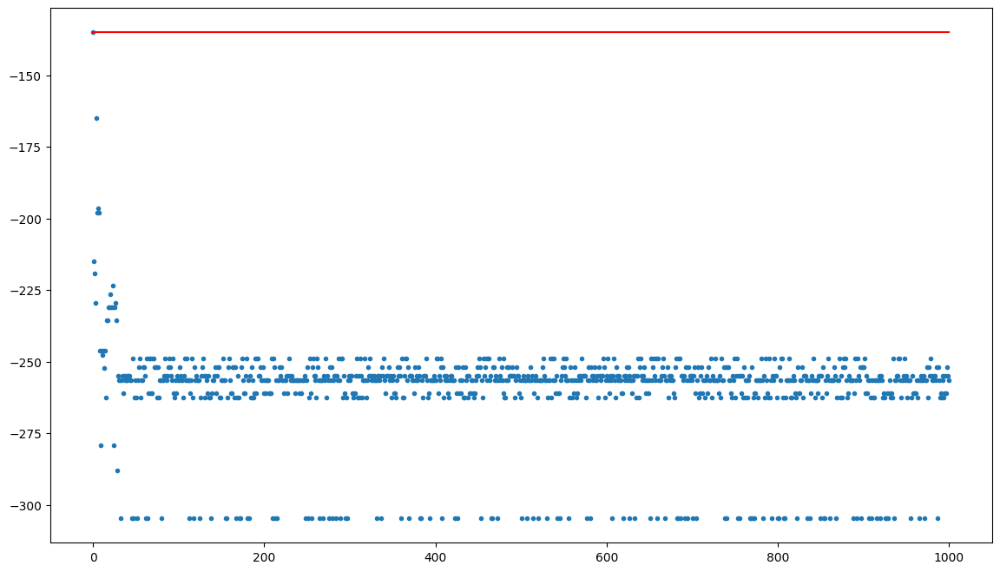
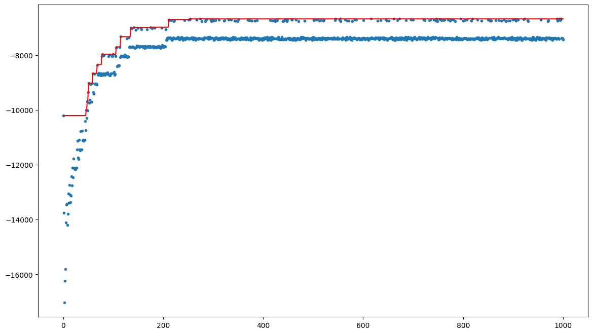
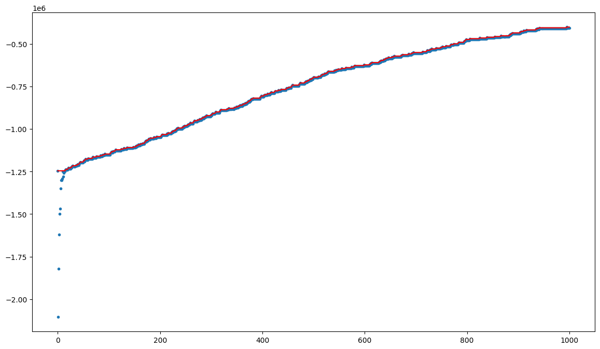
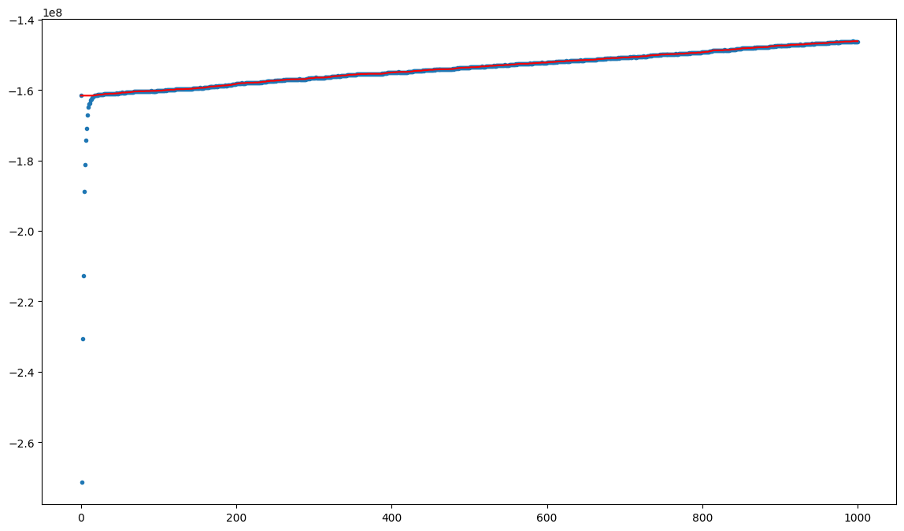
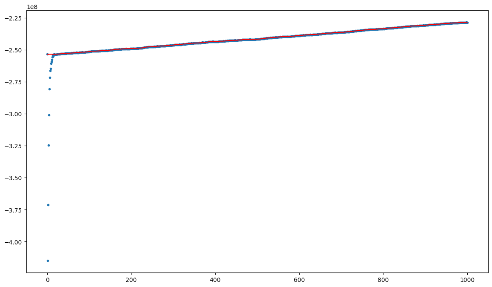

# CI2024_lab1

### Solution 1
The first solution is based on a trivial Random Mutation Hill Climbing approach with a single subset flipping. 
This algorithm has a fitness function related to both the number of elements covered and the total cost of the current solution. The main issue with this approach is that the cost minimization has actually less impact with respect to the coverage maximization, meaning that, even if it is able to produce solutions with few subsets, those subsets tend to have many elements, and since the cost is not directly proportional to the number of elements of a subset, this can lead to non-optimal situations. 
This solution has a better performance with many elements/subsets. For low values of elements and subsets the algorithm produces solutions with poor (or even absent) optimization.

### Solution 2
The second solution is based on a Random Mutation Hill Climbing approach implementing simulated annealing. 
This algorithm has a better optimization consistancy with respect to the previous one, but the cost optimization is generally not high. On the other hand, this approach is much slower compared to the one of solution 1. 

Results obtained with this solution:

| Instance | Best total cost | Iterations |
|----------|-----------|------------|
| 1 | 287.94561681982594 | 1000 |
| 2 | 7055.7799907335675 | 1000 |
| 3 | 401529.7671634129 | 1000 |
| 4 | 69687328.27098742 | 1000 |
| 5 | 146141843.5426583 | 1000 |
| 6 | 228464298.07913643 | 1000 |

The plots related to these results are the following: 
### Instance 1  

### Instance 2  

### Instance 3  

### Instance 4  

### Instance 5  

### Instance 6  

